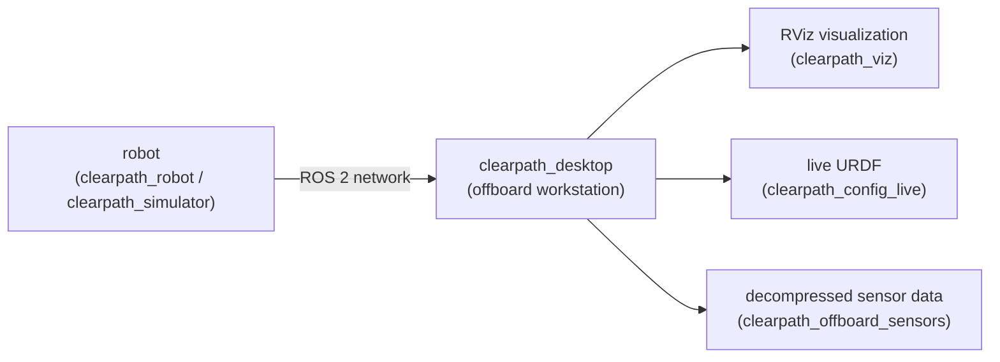

# clearpath_desktop

Packages for working with Clearpath platforms from a **ROS 2 desktop / offboard computer** — the
operator's workstation rather than the robot itself.

For supported platforms, sensors, and manipulators plus additional details, please see:
<https://docs.clearpathrobotics.com/docs/ros/>

## Where this fits in the Clearpath ROS 2 stack

The robot runs `clearpath_robot` (or `clearpath_simulator`) and publishes its topics over the
network. `clearpath_desktop` runs on a *separate* computer on the same network to visualize,
teleoperate, and consume high-bandwidth data from that robot. It reuses the same `robot.yaml` and
`clearpath_common` descriptions so the desktop's view matches the robot's actual configuration.



## Packages

| Package | Description |
| --- | --- |
| `clearpath_desktop` | Metapackage aggregating the desktop-side packages. |
| `clearpath_viz` | RViz visualization launchers for Clearpath platforms. |
| `clearpath_config_live` | Live URDF updater driven by the Clearpath configuration, so the description on the desktop tracks the robot's current config. |
| `clearpath_offboard_sensors` | Launch files for decompressing and consuming high-bandwidth sensor data (e.g. camera streams) on the offboard computer. |

## Requirements

- A desktop with ROS 2 installed, on the **same network** as the robot.
- Matching ROS domain / middleware settings so the desktop can discover the robot's topics.

## Build

From your ROS 2 workspace root:

```bash
rosdep install --from-paths src --ignore-src -r -y
colcon build --symlink-install
source install/setup.bash
```

## Notes

- These packages are meant to run **off** the robot. On-robot bringup lives in `clearpath_robot`.
- Discovery depends on network configuration (ROS domain ID, discovery server / middleware). If the
  desktop sees no topics, verify these match the robot's `system` settings in `robot.yaml`.

## Documentation

- [Offboard PC setup](https://docs.clearpathrobotics.com/docs/ros/installation/offboard_pc) — installing ROS 2 on the workstation.
- [Visualizing with RViz2](https://docs.clearpathrobotics.com/docs/ros/tutorials/rviz).
- [Networking](https://docs.clearpathrobotics.com/docs/ros/networking/overview) — connecting the desktop to the robot.

## License

BSD. See [LICENSE](LICENSE).
